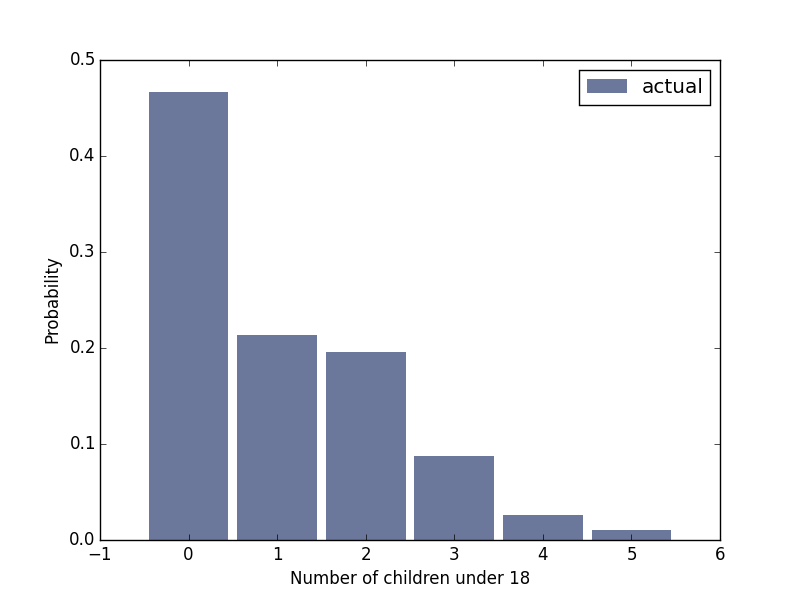
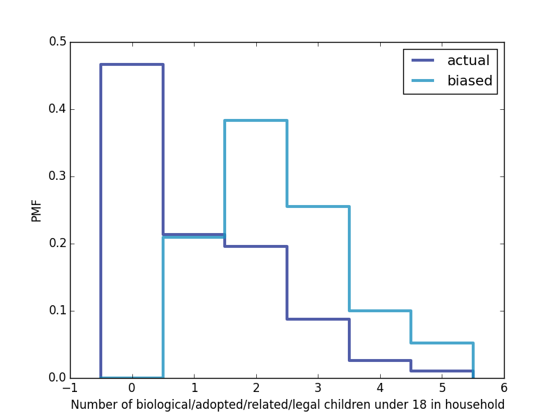

[Think Stats Chapter 3 Exercise 1](http://greenteapress.com/thinkstats2/html/thinkstats2004.html#toc31) (actual vs. biased)

###### Import packages
    import chap01soln
    import thinkstats2
    import thinkplot

###### Download data
    resp = chap01soln.ReadFemResp()

###### Create pmf of NUMKDHH variable
    pmf = thinkstats2.Pmf(resp.numkdhh,label='actual')

###### Create and show pmf plot of NUMKDHH
    thinkplot.Hist(pmf)
    thinkplot.Config(xlabel='Number of children under 18',ylabel='Probability')
    thinkplot.Show()

###### Define BiasPmf function
    def BiasPmf(pmf, label=''):
        """Returns the Pmf with oversampling proportional to value.

        If pmf is the distribution of true values, the result is the
        distribution that would be seen if values are oversampled in
        proportion to their values; for example, if you ask students
        how big their classes are, large classes are oversampled in
        proportion to their size.

        Args:
          pmf: Pmf object.
          label: string label for the new Pmf.

         Returns:
           Pmf object
        """
        new_pmf = pmf.Copy(label=label)

        for x, p in pmf.Items():
            new_pmf.Mult(x, x)
        
        new_pmf.Normalize()
        return new_pmf

###### Calculate the biased pmf of number of children under 18
    biased_pmf = BiasPmf(pmf,label='biased')

###### Plot histograms of both actual and biased pmfs
    thinkplot.PrePlot(2)
    thinkplot.Pmfs([pmf,biased_pmf])
    thinkplot.Show(xlabel='Number of biological/adopted/related/legal children under age 18 in household',ylabel='PMF')

###### Calculate and print means of both actual and biased pmf distrubutions of number of children under 18 in household

    print "Actual mean" + pmf.Mean()
    print "Biased mean" + biased_pmf.Mean()

###### Returns ('Actual mean', 1.0242051550438309)
###### Returns ('Biased mean', 2.4036791006642821)
