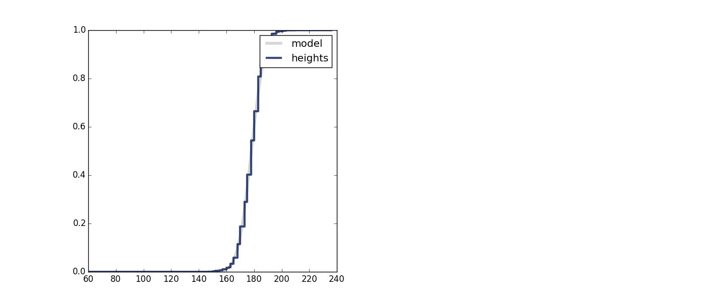

[Think Stats Chapter 5 Exercise 1](http://greenteapress.com/thinkstats2/html/thinkstats2006.html#toc50) (blue men)

##### Import ThinkStats2 packages, pandas and numpy
    import brfss
    import thinkstats2
    import pandas
    import numpy as np
    import scipy.stats

##### Read and clean Brfss data
    df = brfss.ReadBrfss()
    brfss.CleanBrfssFrame(df)

##### Create subset of dataframe to check the mean and standard deviation of men's heights
    df_men = df[df.sex==1]
    men_htm3_mean = df_men.htm3.mean()
    men_htm3_std = df_men.htm3.std()
    
##### Mean of men's height is 178.1 cm, standard deviation is 7.7 cm
    print "Mean: " + str(np.around(men_htm3_mean,2))
    print "Standard deviation: " + str(np.around(men_htm3_std,2))

##### Find the cdf of men's heights at 5'10" (177.8 cm) and at 6'1" (185.4 cm)
    print "CDF of men's height at 177.8 cm: " + str(scipy.stats.norm(men_htm3_mean,men_htm3_std).cdf(177.8))
    print "CDF of men's height at 185.4 cm: " + str(scipy.stats.norm(men_htm3_mean,men_htm3_std).cdf(185.4))

##### Yields .486 and .829 respectively

##### Plot the cdf of men's heights to fit a normal distribution
    cdf = thinkstats2.Cdf(df_men.htm3,label='heights')
    xmin = men_htm3_mean - 4 * men_htm3_std
    xmax = men_htm3_mean + 4 * men_htm3_std
    xs,ps = thinkstats2.RenderNormalCdf(men_htm3_mean,men_htm3_std,xmin,xmax)
    thinkplot.Plot(xs,ps,label='model',linewidth=4,color='0.8')
    thinkplot.Cdf(cdf)
    thinkplot.Show()

##### Assuming a normal distribution, we can say that 34% [(.829-.486)*100] of men are in the height range of 5'10" and 6'1"
  
