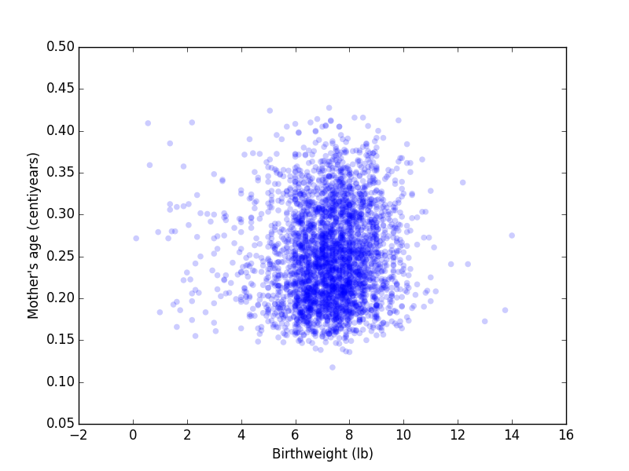

[Think Stats Chapter 7 Exercise 1](http://greenteapress.com/thinkstats2/html/thinkstats2008.html#toc70) (weight vs. age)

##### Import packages
    import nsfg
    import thinkplot
    
##### Read and clean data into dataframe file df
    df = nsfg.ReadFemPreg()
    nsfg.CleanFemPreg(df)
    
##### Assign variables for weight of baby at birth, and age of mother at time of pregnancy
    weight,age = df.totalwgt_lb, df.agepreg
    
##### Initial scatterplot of birth weight vs mother's age
    thinkplot.Scatter(weight,age)
    thinkplot.Show(xlabel='Birth weight (lb)',ylabel="Mother's age")

##### Generate CDF of birthweight
    cdf_weight = thinkstats2.Cdf(weight)
    
##### Find 25th, 50th, 75th, 100th percentile
##### Result is weight_array = [6.5, 7.375, 8.0625, 15.4375]
    weight_array = []
    percentiles = (25,50,75,100)
    for i in percentiles:
        weight_array.append(thinkstats2.Cdf.Percentile(cdf_weight,i))
    print "25th, 50th, 75th, 100th percentiles: " + weight_array

