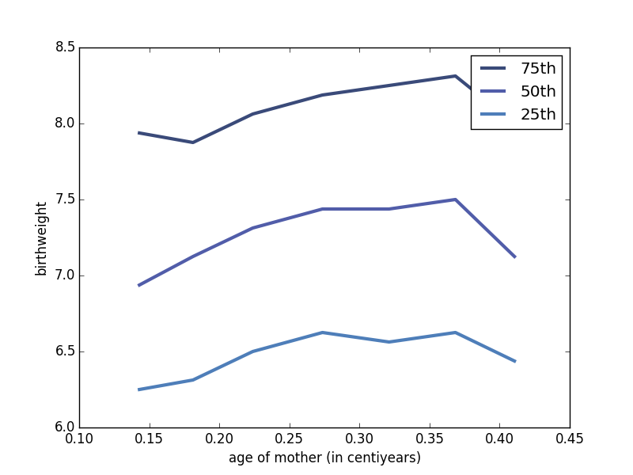

[Think Stats Chapter 7 Exercise 1](http://greenteapress.com/thinkstats2/html/thinkstats2008.html#toc70) (weight vs. age)

##### Import packages
    import nsfg
    import thinkplot
    import thinkstats2
    import numpy as np
    
##### Read and clean data into dataframe file df
    df = nsfg.ReadFemPreg()
    nsfg.CleanFemPreg(df)
    
##### Drop NaN values from agepreg and totalwgt_lb variables
    df = df[np.isfinite(df['agepreg'])]
    df = df[np.isfinite(df['totalwgt_lb'])]
    
##### Assign variables for weight of baby at birth, and age of mother at time of birth
    weight,age = df.totalwgt_lb, df.agepreg
    
##### Initial scatterplot of birth weight vs mother's age
    thinkplot.Scatter(weight,age)
    thinkplot.Show(xlabel='Birth weight (lb)',ylabel="Mother's age")

##### Bin data by age of mother at time of birth
    bins = np.arange(0,.5,.05)
    indices = df.groupy(indices)
    groups = df.groupby(indices)
    
##### Computer mean age and CDF of birthweight
    ages = [group.agepreg.mean() for i,group in groups]
    cdfs = [thinkstats2.Cdf.(group.totalwgt_lb) for i,group in groups]

##### Plot percentiles of birthweight versus age
    for percent in [75,50,25]:
        weights = [cdf.Percentile(percent) for cdf in cdfs]
        label = '%dth' % percent
        thinkplot.Plot(ages,weights,label=label)
    thinkplot.Show(xlabel='age of mother (in centiyears)',ylabel = 'birthweight')
    

##### Compute Pearson's correlation
##### Result prints: 
Pearson's correlation: 0.0688
    pear_corr = thinkstats2.Corr(weight,age)
    print "Pearson's correlation: " + str(np.around(pear_corr,4))

##### Compute Spearman's rank correlation
##### Result prints:
Spearman's rank correlation: 0.0946
    spear_corr = thinkstats2.SpearmanCorr(weight,age)
    print "Spearman's rank correlation: " + str(np.around(spear_corr,4))

##### Conclusions:
Given these correlation statistics, we can conclude that there is either no significant relationship or a non-linear relationship between these two variables

