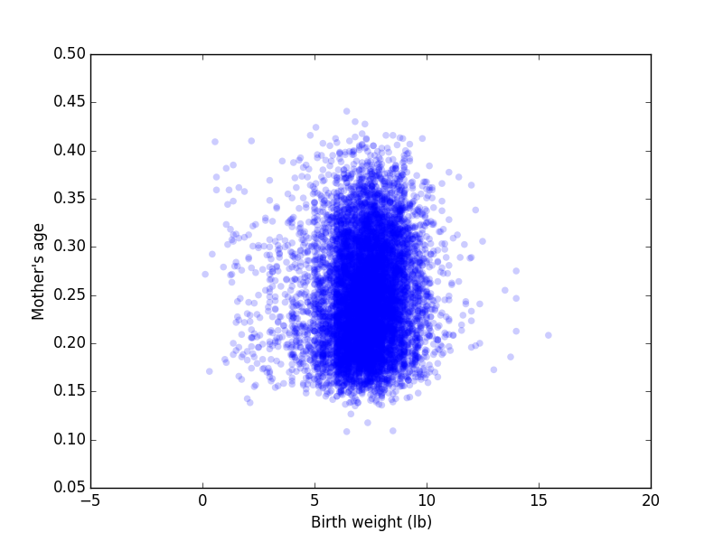

[Think Stats Chapter 7 Exercise 1](http://greenteapress.com/thinkstats2/html/thinkstats2008.html#toc70) (weight vs. age)

##### Import packages
    import nsfg
    import thinkplot
    import thinkstats2
    import numpy as np
    
##### Read and clean data into dataframe file df
    df = nsfg.ReadFemPreg()
    nsfg.CleanFemPreg(df)
    
##### Drop NaN values from agepreg and totalwgt_lb variables
    df = df[np.isfinite(df['agepreg'])]
    df = df[np.isfinite(df['totalwgt_lb'])]
    
##### Assign variables for weight of baby at birth, and age of mother at time of pregnancy
    weight,age = df.totalwgt_lb, df.agepreg
    
##### Initial scatterplot of birth weight vs mother's age
    thinkplot.Scatter(weight,age)
    thinkplot.Show(xlabel='Birth weight (lb)',ylabel="Mother's age")

##### Generate CDF of birthweight
    cdf_weight = thinkstats2.Cdf(weight)
    
##### Find weight percentiles of interest
##### Result prints: 
Min, 25th percentile, 50th percentile, 75th percentile, Max: 0.125, 6.5, 7.375, 8.125, 15.4375
    weight_array = []
    percentiles = (0,25,50,75,100)
    for i in percentiles:
        weight_array.append(thinkstats2.Cdf.Percentile(cdf_weight,i))
    print 'Min, 25th percentile, 50th percentile, 75th percentile, Max: ' + ", ".join(map(str,weight_array))

##### Compute Pearson's correlation
##### Result prints: 
Pearson's correlation: 0.0688
    pear_corr = thinkstats2.Corr(weight,age)
    print "Pearson's correlation: " + str(np.around(pear_corr,4))

##### Compute Spearman's rank correlation
##### Result prints:
Spearman's rank correlation: 0.0946
    spear_corr = thinkstats2.SpearmanCorr(weight,age)
    print "Spearman's rank correlation: " + str(np.around(spear_corr,4))

##### Conclusions:
Given these correlation statistics, we can conclude that there is either no significant relationship or a non-linear relationship between these two variables

