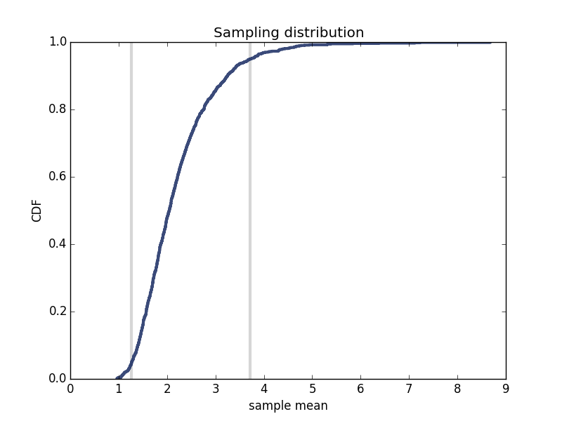
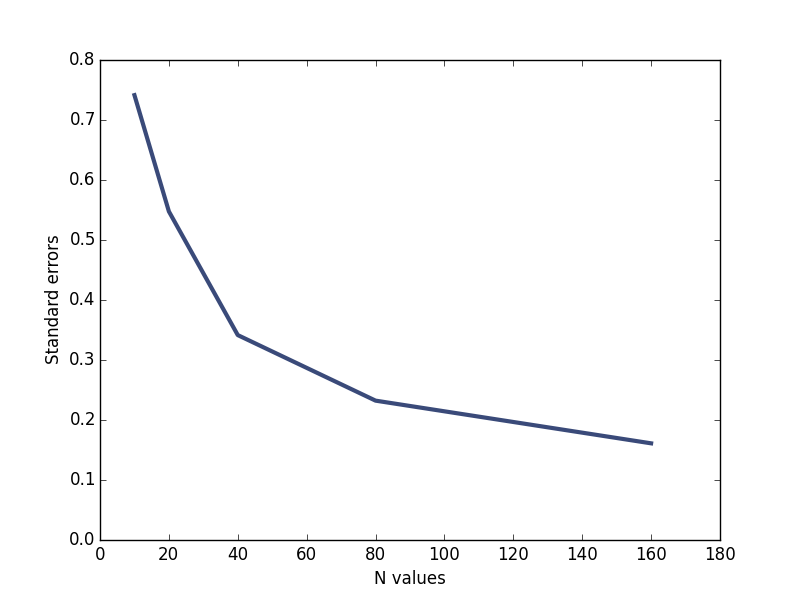

[Think Stats Chapter 8 Exercise 2](http://greenteapress.com/thinkstats2/html/thinkstats2009.html#toc77) (scoring)

##### Import packages
    import estimation
    import numpy as np
    import thinkstats2
    import thinkplot
    
##### Define function to simulate and plot sample distribution
##### Modified existing SimulateSample() function from estimation package
    def SimulateSampleExp(n=10, m=1000):
    """Plots the sampling distribution of the sample mean.

    L: lambda
    n: sample size
    m: number of iterations
    """
        lam = 2
    
        def VertLine(x, y=1):
            thinkplot.Plot([x, x], [0, y], color='0.8', linewidth=3)

        means = []
        for _ in range(m):
            xs = np.random.exponential(1.0/lam,n)
            L = 1/np.mean(xs)
            means.append(L)

        stderr = estimation.RMSE(means, lam)
        print('standard error', stderr)

        cdf = thinkstats2.Cdf(means)
        ci = cdf.Percentile(5), cdf.Percentile(95)
        print('confidence interval', ci)
        VertLine(ci[0])
        VertLine(ci[1])

        thinkplot.Cdf(cdf)
        thinkplot.Show(root='estimation1',
                   xlabel='sample mean',
                   ylabel='CDF',
                   title='Sampling distribution')

    SimulateSampleExp()
    
##### Resulting output is:
standard error 0.8502093486
confidence interval (1.2682331374299645, 3.7119948331185322)

##### Plot of sampling distribution:

##### Experiment with different values of sample size n
##### Modified exisiting Estimate3() function from estimation package to return only standard error value
    def Estimate3_stderror(n=7, m=1000):
    """Evaluates L as estimator of the exponential parameter.

    n: sample size
    m: number of iterations
    """
        lam = 2

        means = []
        medians = []
        for _ in range(m):
            xs = np.random.exponential(1.0/lam, n)
            L = 1 / np.mean(xs)
            Lm = math.log(2) / np.median(xs)
            means.append(L)
            medians.append(Lm)

        return estimation.RMSE(means, lam)

##### Generated standard errors (std_errs) based on different values of n (n_values)
    n_values = [10,20,40,80,160]
    std_errs = []
    for i in n_values:
        std_errs.append(Estimate3_stderror(n=i))
    
##### Plot n values vs standard errors
    thinkplot.Plot(n_values,std_errs)
    thinkplot.Config(xlabel="N values",ylabel="Standard errors",axis=[0,180,0,.8])
    thinkplot.Show()
    
