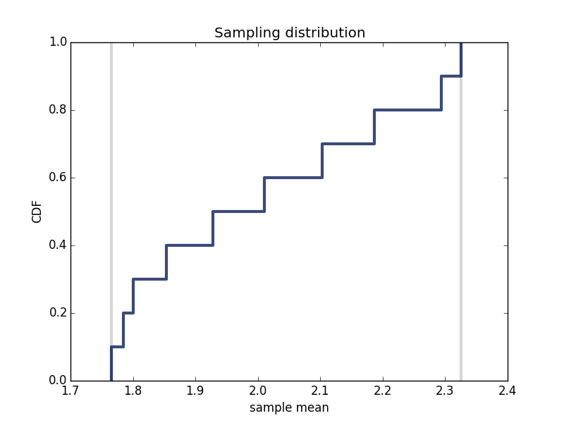

# 4) Think Stats Exercise 8.3

Problem: [Think Stats Chapter 8 Exercise 3](http://greenteapress.com/thinkstats2/html/thinkstats2009.html#toc77)

---
##### Import packages
    import thinkplot
    import numpy as np

##### SimulateGame function takes goal-scoring rate lam, and simulates a 90 minute game
##### Returns total goals 
    def SimulateGame(lam = 2):
        total_time = 90
        sim_game = np.random.exponential(1.0/lam,total_time)
        L = 1/np.mean(sim_game)
        return L
    
##### SumlateGames function simulates many games
##### Plots sample distribution
    def SimulateGames(lam = 2, games = 10):
        total_time = 90
        means = []
        for i in range(games):
            sim_game = np.random.exponential(1.0/lam,total_time)
            L = 1/np.mean(sim_game)
            means.append(L)
        
        print('rmse L',estimation.RMSE(means,lam))
        print('mean error L',estimation.MeanError(means,lam))

        def VertLine(x, y=1):
            thinkplot.Plot([x, x], [0, y], color='0.8', linewidth=3)

        cdf = thinkstats2.Cdf(means)
        ci = cdf.Percentile(5), cdf.Percentile(95)
        
        VertLine(ci[0])
        VertLine(ci[1])

        thinkplot.Cdf(cdf)
        thinkplot.Show(xlabel='sample mean',
                   ylabel='CDF',
                   title='Sampling distribution')

Sampling error seems to increase as lambda increases. 

---